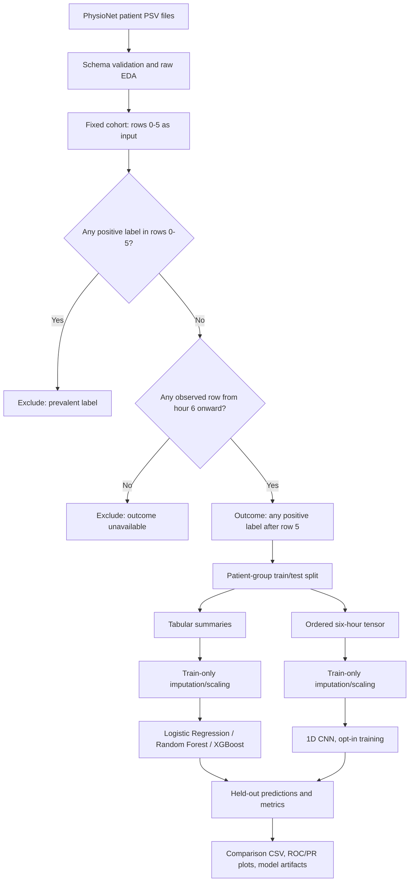

# Experimental Design and Project Plan

## Data Flow

## Evaluation Protocol

- The fixed six-row look-back and subsequent-label outcome rule are shared between tabular and sequence representations.
- Patient IDs are groups, not predictors. The single `GroupShuffleSplit` is deterministic for a fixed seed and cohort ordering.
- Imputation and scaling parameters are learned from training patients only. The CNN likewise estimates each input variable's median, mean, and standard deviation on training tensors only.
- The 0.5 threshold is fixed by default and is recorded. It is not tuned against the test set.
- AUROC and average precision are reported only where both outcome classes occur in the test set. Sensitivity, specificity, precision, F1, accuracy, Brier score, and confusion matrix are also saved.
- The CNN comparison changes both input representation and model family; a performance difference cannot be attributed to architecture alone.
- This is retrospective educational analysis, not a clinically validated decision-support system. Challenge utility and direct comparison with challenge submissions are not implemented.

## Indicative Eight-Week Plan

The calendar dates above are illustrative placeholders and should be shifted to the module's confirmed submission schedule.

| Work package | Activities | Indicative timing |
|---|---|---|
| Design and dataset setup | Confirm timing rule, obtain data, validate schema | Week 1 |
| Exploratory analysis | Record lengths, class balance, missingness, distributions | Weeks 1-2 |
| Cohort and preprocessing | Leakage checks, feature engineering, patient split | Weeks 2-3 |
| Tabular baselines | Logistic Regression and Random Forest | Weeks 3-4 |
| Boosted trees | XGBoost and interpretation | Weeks 4-5 |
| Temporal model | Sequence preparation and 1D CNN | Weeks 5-6 |
| Evaluation | Comparison table, plots, robustness review | Weeks 6-7 |
| Reporting | Limitations, results, reproducibility | Weeks 7-8 |

## Reproduction Record

Each model run writes `run_config.json`, `split_patients.json`, `feature_names.json`, and held-out predictions alongside metrics and model files. Record the installed package versions when preparing a final report; the same random seed does not guarantee bit-identical results across different library versions or hardware backends.
